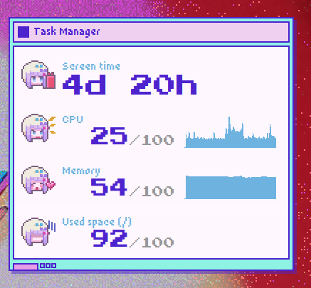

> It's like Task Manager but like conky, okay?

Rainmeter is not available for Linux so I made this.
Inspired by https://github.com/lezzthanthree/Needy-Streamer-Overload

I'm not gonna copy any other modules from it, don't @ me

